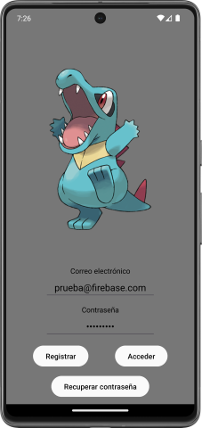
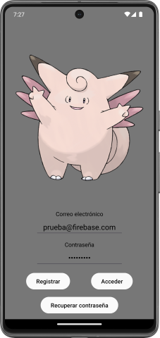
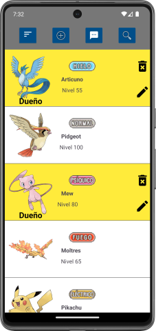
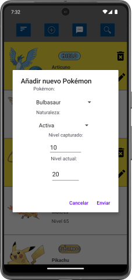
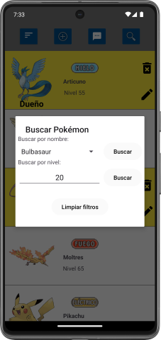
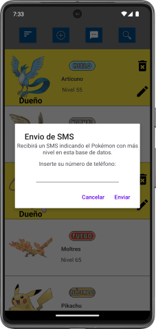

# Pokébox
Pokébox is an Android pokémon shared box app. It allows you to have your own pokémon, view other users' pokémon, search and sort the database.

It was built in Kotlin using Android Studio and Google Firebase database.

> [!NOTE]  
> This app was made when I was a student and had a tight deadline, so don't expect quality code.

# Images

